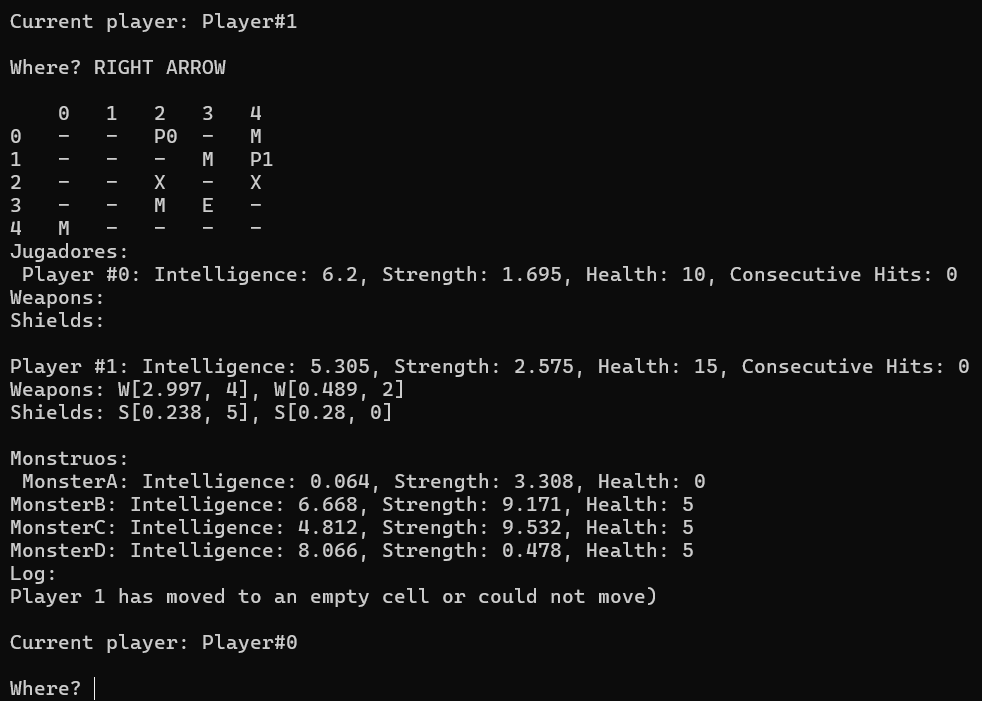

# Irrgarten – Ruby

**Development period:** September – December 2025  
**Course:** Object-Oriented Programming and Design (PDOO)  
**University:** University of Granada  
**Language:** Ruby  

Irrgarten is an academic object-oriented programming project developed progressively throughout the Object-Oriented Programming and Design course at the University of Granada.

This repository contains the **Ruby implementation** of the project, developed alongside the Java version to apply the same object-oriented design concepts in two languages with different characteristics.

The project implements a labyrinth-based game in which several players must navigate a board, confront monsters and reach the exit before the other players.

Its main purpose was to apply object-oriented software design concepts to a complete application and explore how the same design can be implemented using Ruby's language features.

## Gameplay



At the beginning of the game, players are placed randomly inside a labyrinth containing walls, monsters and an exit.

During each turn, a player attempts to move to an adjacent cell. If the destination contains a monster, a combat starts automatically.

Players have attributes such as:

- Strength
- Intelligence
- Health
- Weapons
- Shields

Weapons increase attack power and shields contribute to defensive capabilities, although both have a limited number of uses.

Winning combats can reward players with new weapons, shields and health. Players can also die and may be resurrected during later turns.

The game finishes when one of the players reaches the exit of the labyrinth.

## Object-Oriented Design

The project was developed incrementally, introducing increasingly advanced object-oriented programming concepts.

### Domain modelling

The core game logic is distributed among classes with specific responsibilities, including:

- `Game` — manages the overall game flow, turns, combat and game state.
- `Labyrinth` — represents the board and manages players, monsters, obstacles and movement.
- `Player` — models the state and behaviour of a player.
- `Monster` — represents enemies located inside the labyrinth.
- `Weapon` — models offensive combat elements.
- `Shield` — models defensive combat elements.
- `Dice` — centralizes random decisions and probabilities used throughout the game.
- `GameState` — provides a representation of the complete state of a game.

The implementation follows a separation of responsibilities between classes, applying principles such as high cohesion and low coupling.

### Inheritance and polymorphism

The design was later refactored to introduce inheritance and polymorphism.

`LabyrinthCharacter` acts as a base class for the different characters in the game:

- `Player`
- `Monster`

Similarly, common behaviour between weapons and shields is generalized through `CombatElement`.

The project also introduces `FuzzyPlayer`, a specialized player whose movement, attack and defensive behaviour incorporate probabilistic decisions.

These changes provided practical experience with:

- Inheritance
- Method overriding
- Polymorphism
- Dynamic binding
- Generalization of common behaviour

### Ruby-specific implementation

The Ruby version required adapting several design decisions to the characteristics of the language.

Some examples include:

- Using modules to represent enumerated values.
- Following `snake_case` naming conventions for methods.
- Using Ruby `Array` collections for object containers.
- Adapting object-copying mechanisms because Ruby does not provide constructor overloading in the same way as Java.
- Implementing equivalent object-oriented behaviour using Ruby's dynamic language features.

These adaptations made it possible to compare how the same software design can be implemented in both statically and dynamically typed object-oriented languages.

## Application Architecture

The project separates the game logic from user interaction.

### Text interface

`TextUI` provides a console-based interface responsible for:

- Displaying the current state of the game.
- Showing information about the labyrinth, players and monsters.
- Receiving movement instructions from the user.

### Controller

The `Controller` coordinates the interaction between the game model and the text-based user interface.

This separation allows the game logic to remain independent from the code responsible for interacting directly with the player.

The Ruby implementation contains the text-based architecture developed during the course. The later graphical interface implemented with Java Swing was developed exclusively for the Java version.

## Project evolution

The project was developed progressively through several practical assignments:

1. **Object-oriented fundamentals**
   - Classes and objects
   - Encapsulation
   - Simulated enumerated types
   - Randomized game behaviour
   - Initial testing programs

2. **Structural design implementation**
   - Complete class structure
   - Relationships between objects
   - Collections and two-dimensional board structures
   - Game, labyrinth, player and monster modelling

3. **Dynamic behaviour**
   - Implementation from sequence diagrams
   - Complete game mechanics
   - Combat and movement logic
   - Console user interface
   - Controller integration
   - Debugging and targeted testing

4. **Inheritance and polymorphism**
   - Base classes
   - Method overriding
   - Dynamic binding
   - `FuzzyPlayer`
   - Refactoring of common behaviour

## Project structure

```text
irrgarten-ruby/
├── Controller/
├── TextUI/
├── images/
│   └── gameplay.png
├── combat_element.rb
├── dice.rb
├── directions.rb
├── enumerados.rb
├── fuzzy_player.rb
├── game.rb
├── game_state.rb
├── labyrinth.rb
├── labyrinth_character.rb
├── main.rb
├── monster.rb
├── player.rb
├── shield.rb
└── weapon.rb
````

## Academic context

The project was developed from specifications, UML class diagrams and sequence diagrams provided throughout the course.

My work consisted of translating those designs into a complete Java implementation, developing the game logic, applying inheritance and polymorphism, implementing generic components and integrating both text and graphical user interfaces.
